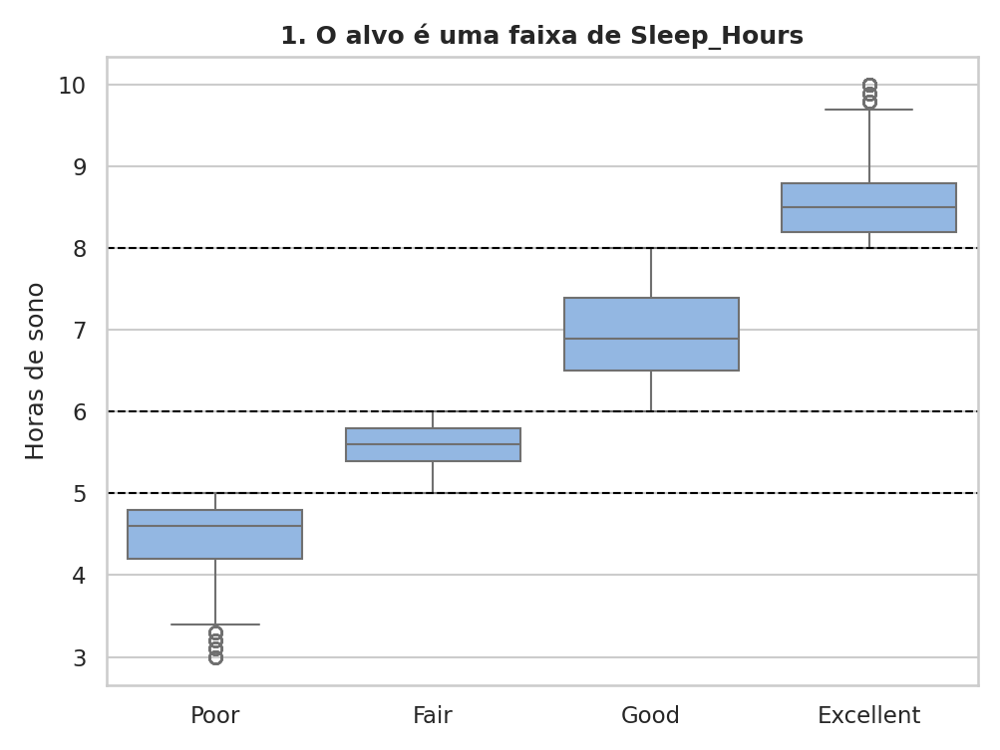
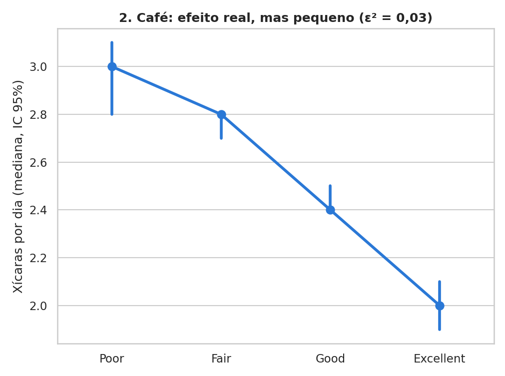
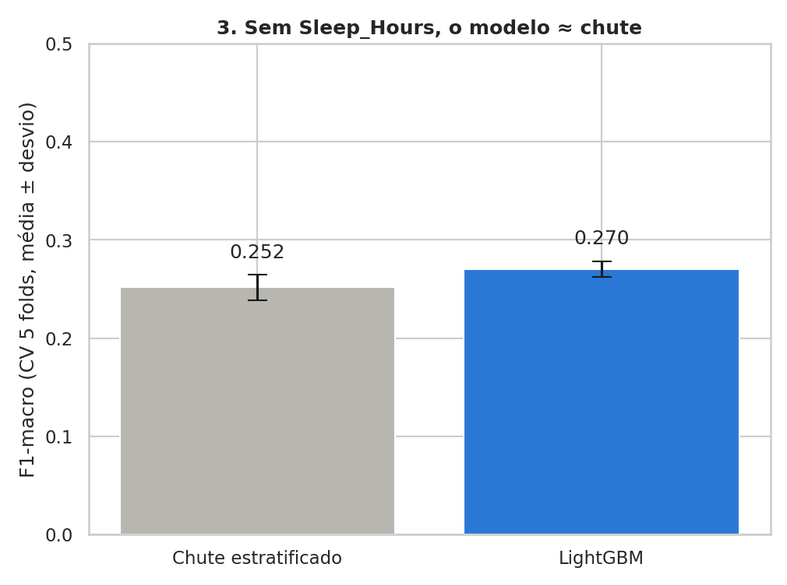
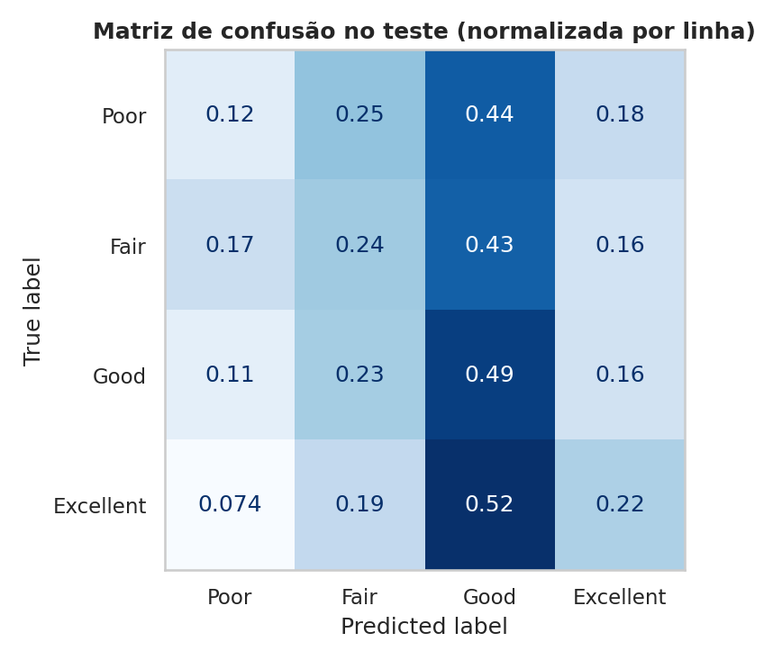
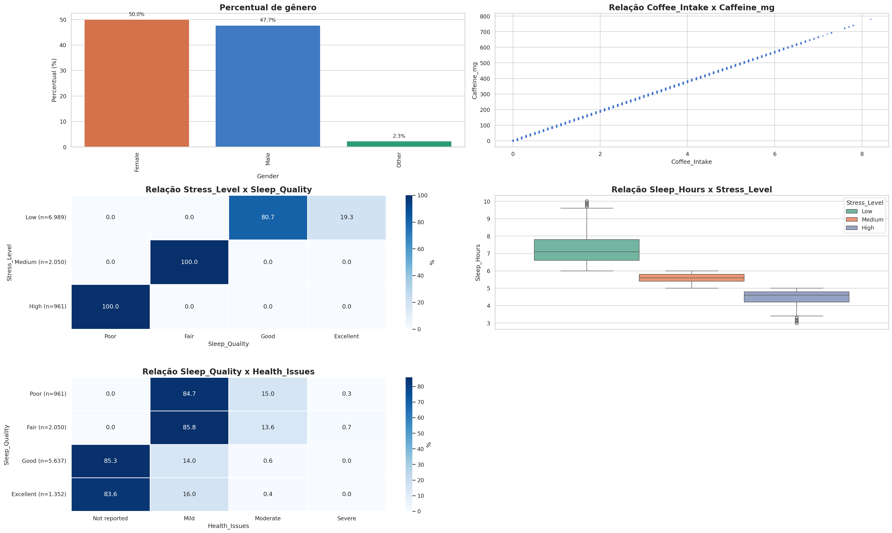
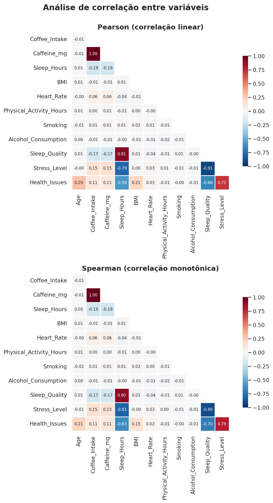

# Coffee & Sleep — o que explica a qualidade do sono?

Análise exploratória, testes estatísticos e modelagem sobre **10.000 registros** de consumo de café, hábitos de sono e indicadores de saúde em 20 países ([Global Coffee Health Dataset](https://www.kaggle.com/datasets/uom190346a/global-coffee-health-dataset), Kaggle).

**Pergunta:** quais fatores de estilo de vida estão associados à qualidade do sono (`Sleep_Quality`: Poor, Fair, Good, Excellent), e é possível prevê-la a partir deles?

## Resumo

- **A qualidade do sono é uma regra sobre as horas de sono.** Poor vai até 5 h, Fair de 5 a 6 h, Good de 6 a 8 h e Excellent a partir de 8 h. O nível de estresse segue a mesma regra (Cramér's V = 1,0). Essas variáveis não explicam o sono: são o próprio sono medido de outro jeito.
- **Fora delas, só o café tem efeito, e pequeno.** Quem dorme pior toma mais café (mediana de 3,0 xícaras em Poor contra 2,0 em Excellent), mas isso explica cerca de 3% da variação (ε² = 0,03).
- **O estilo de vida não prevê a qualidade do sono.** Sem as variáveis que definem o alvo, o LightGBM chega a F1-macro de 0,270 ± 0,008, contra 0,252 ± 0,013 de um chute estratificado. O ganho é do tamanho da variação entre folds.

> Os dados são sintéticos. Os resultados demonstram o método, não uma relação real entre café e sono.

## Principais resultados

### 1. O alvo é uma faixa de `Sleep_Hours`

<p align="center"></p>

As faixas de horas de cada classe não se sobrepõem: elas só se encostam no valor exato de cada limite (5, 6 e 8 h). Isso afeta 576 registros (5,8%) e é compatível com a classificação ter sido feita antes de as horas serem arredondadas para uma casa decimal. `Stress_Level` mapeia cada nível para classes fixas, sem exceção: High = Poor, Medium = Fair, Low = Good ou Excellent.

### 2. Café: efeito real, mas pequeno

<p align="center"></p>

O consumo de café cai de forma monotônica de Poor para Excellent, e todos os pares de classes diferem entre si (Kruskal-Wallis com post-hoc de Mann-Whitney e correção de Holm). Mesmo assim, o efeito é pequeno: ε² = 0,030.

Idade, IMC, frequência cardíaca, atividade física, país, ocupação, gênero, tabagismo e álcool não mostraram associação relevante com a qualidade do sono após a correção para múltiplos testes.

### 3. Sem `Sleep_Hours`, o modelo empata com o chute

<p align="center"></p>

| Modelo | F1-macro na validação cruzada (5 folds) |
|---|---|
| Chute estratificado (`DummyClassifier`) | 0,252 ± 0,013 |
| LightGBM (`num_leaves=31`, `min_child_samples=30`) | 0,270 ± 0,008 |
| LightGBM no conjunto de teste (avaliado uma única vez) | 0,265 |

<p align="center"></p>

- **O modelo erra a maior parte das classes minoritárias:** recall de 0,12 para Poor e de 0,22 para Excellent.
- **O overfitting é sintoma, não causa.** O modelo chega a F1 de 0,910 no treino contra 0,270 na validação. Regularizar derruba o F1 de treino (0,910 → 0,676 → 0,446), mas a validação não melhora (0,270 → 0,257 → 0,251). O modelo memoriza porque não há padrão generalizável a aprender.
- **A importância por permutação confirma:** só `Coffee_Intake` tem efeito perceptível (embaralhá-la derruba o F1 em ~0,026); as demais ficam perto de zero.

## Metodologia

O projeto segue as etapas do CRISP-DM: problema → dados → preparação → modelagem → avaliação → conclusão.

**Qualidade e tratamento dos dados**
- A checagem de qualidade roda na base bruta, antes de qualquer transformação: 10.000 linhas, 16 colunas, nenhum registro duplicado.
- Os únicos ausentes estão em `Health_Issues`: 5.941 células vazias (59,4%). O vazio **não é dado faltante**. O dicionário do dataset lista a categoria None (sem problema de saúde), que não aparece no CSV, e o grupo segue um padrão claro com o alvo (0% dos Poor/Fair e ~85% dos Good/Excellent). Por isso ele virou a categoria `No Issues`, em vez de ser imputado ou descartado.
- As variáveis ordinais (`Sleep_Quality`, `Stress_Level` e `Health_Issues`) viraram categóricas ordenadas.

**Testes estatísticos**
- A escolha do teste depende dos pressupostos: normalidade por grupo (Shapiro-Wilk ou D'Agostino) e homogeneidade de variâncias (Levene).
  - 2 grupos: t de Student, t de Welch ou Mann-Whitney.
  - 3 ou mais grupos: ANOVA com post-hoc de Tukey ou Kruskal-Wallis com Mann-Whitney + Holm.
  - Categórica × categórica: qui-quadrado com V de Cramér e resíduos padronizados.
- Todo teste reporta o **tamanho de efeito** (Cohen's d, rank-biserial, η², ε² ou V de Cramér), porque com 10.000 registros quase tudo dá significativo.
- Correção para múltiplos testes pelo método de Benjamini-Hochberg (FDR).

**Variáveis retiradas do modelo**
- `Sleep_Hours` e `Stress_Level` definem o alvo. Usá-las seria prever o alvo a partir dele mesmo.
- `Health_Issues` é uma consequência provável: problema de saúde tende a ser efeito do sono ruim, e não um hábito que o explique.
- `Caffeine_mg` é redundante (≈ 95 × `Coffee_Intake`, r = 0,9998), e `ID` não carrega informação.

**Modelagem e avaliação**
- A métrica é o **F1-macro**, que pesa as 4 classes igualmente (Good tem 5.637 casos, Poor tem 961), e o LightGBM usa `class_weight="balanced"`.
- 25% da base fica separada como **teste** e só é usada uma vez, no fim.
- As configurações são comparadas por **validação cruzada estratificada (5 folds)** nos 75% restantes. O ganho sobre o chute é calculado fold a fold, com as mesmas divisões para os dois.

<details>
<summary><b>Mais gráficos da análise exploratória</b></summary>

<p align="center"></p>
<p align="center"></p>

Todos os gráficos gerados pelo notebook ficam em [`reports/figures/`](reports/figures/).

</details>

## Estrutura do repositório

```
COFFEE-SLEEP/
├── data/
│   └── raw/                 # CSV original do Kaggle
├── notebooks/
│   └── projeto.ipynb        # análise completa: EDA, testes, modelagem e conclusão
├── reports/
│   └── figures/             # gráficos gerados pelo notebook
└── src/
    └── projeto/
        ├── visualizer.py    # gráficos: painéis, heatmaps, tabela cruzada, composição, dispersão
        └── testes.py        # testes estatísticos com escolha automática e conclusão em português
```

## Como reproduzir

Requer Python 3.10 ou superior.

```bash
git clone <url-deste-repositório>
cd COFFEE-SLEEP

python -m venv .venv
source .venv/bin/activate        # no Windows: .venv\Scripts\activate
pip install -r requirements.txt
pip install -e .                 # instala o pacote src/projeto
```

1. Baixe o CSV do [Kaggle](https://www.kaggle.com/datasets/uom190346a/global-coffee-health-dataset) e salve em `data/raw/synthetic_coffee_health_10000(in).csv`.
2. Abra `notebooks/projeto.ipynb` e rode todas as células. Os gráficos são salvos em `reports/figures/`.

## Tecnologias

Python · pandas · NumPy · SciPy · statsmodels · scikit-learn · LightGBM · Matplotlib · seaborn

## Limitações e próximos passos

- **Os dados são sintéticos,** gerados a partir de poucas variáveis-semente. As conclusões valem como demonstração de método, não como evidência sobre café e sono.
- **O alvo é ordinal,** mas foi tratado como multiclasse. Métricas ordinais (como o kappa ponderado) penalizariam menos um erro entre classes vizinhas.
- **O próximo passo natural** é repetir o mesmo pipeline com dados reais, em que o alvo não seja uma regra direta sobre uma única variável.

## Autor

**Diogo Moitinho**
